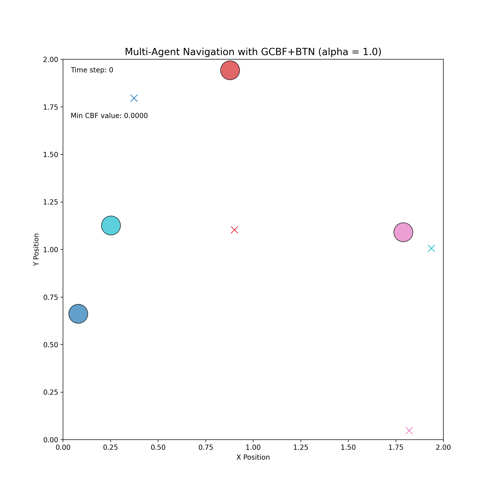

基于可微分物理的多智能体安全敏捷协同策略研究

核心创新理念

本项目融合了图控制屏障函数（GCBF）的安全性与时序反向传播（BPTT）的性能优势，提出了自适应安全边距的创新方法。通过端到端的可微分物理仿真，我们实现了既安全又敏捷的多智能体协同导航，无需传统强化学习中的Q学习、专家策略或重放缓冲区。

核心技术特色

自适应安全边距
创新点：策略网络动态预测CBF安全参数α，而非使用固定值
优势：根据环境复杂度和智能体状态自适应调整安全边距
实现：通过Softplus激活函数确保α值始终为正，配合正则化损失引导学习

时序反向传播优化
方法：直接通过可微分仿真器优化策略和CBF网络
特点：支持时序梯度衰减（GDecay）机制稳定长时域训练
效果：消除了传统RL方法的复杂性，实现端到端学习

性能增强技术
加速度变化率惩罚**：平滑动作输出，提升控制品质
视觉导航支持**：CRNN架构处理深度图像输入
瓶颈场景专项优化**：针对复杂协调场景的专门评估指标

实验结果展示

动态Alpha自适应导航


这展示了我们的动态Alpha策略在复杂障碍物环境中的自适应安全导航能力

环境配置与安装
 1. 克隆仓库
bash
git clone https://github.com/your-username/gcbf-bptt-project.git
cd gcbf-bptt-project


2. 创建Conda环境
bash
conda create -n gcbf-bptt python=3.9
conda activate gcbf-bptt

 3. 安装PyTorch（GPU版本）
bash
CUDA 11.8版本（根据您的CUDA版本调整）
conda install pytorch torchvision torchaudio pytorch-cuda=11.8 -c pytorch -c nvidia
```

 4. 安装其他依赖
```bash
pip install -r requirements.txt
```

5. 验证安装
```bash
python -c "import torch; print(f'PyTorch版本: {torch.__version__}'); print(f'CUDA可用: {torch.cuda.is_available()}')"
```

使用指南

自动化实验运行

运行完整的瓶颈场景对比实验：
```bash
bash run_experiments.sh
```

此脚本将自动执行：
- 动态Alpha模型训练（20,000步）
- 三个固定Alpha基线模型训练
- 生成可视化结果和量化分析报告
单独模型训练

训练动态Alpha模型：
```bash
python train_bptt.py --config config/bottleneck_dynamic_alpha.yaml --env_type double_integrator
```

训练固定Alpha基线：
```bash
python train_bptt.py --config config/bottleneck_fixed_alpha_medium.yaml --env_type double_integrator
```

结果可视化

生成训练结果的可视化：
```bash
python visualize_bptt.py --model_dir logs/bptt --env_type double_integrator
```

配置文件说明

`config/bottleneck_dynamic_alpha.yaml`: 动态Alpha瓶颈实验配置
`config/bottleneck_fixed_alpha_*.yaml`: 固定Alpha基线配置
 `config/bptt_config.yaml`: 标准BPTT训练配置

项目结构

gcbf-bptt-project/
├── gcbfplus/                    # 核心代码库
│   ├── policy/                  # 策略网络实现
│   │   └── bptt_policy.py      # BPTT策略（支持动态Alpha）
│   ├── trainer/                 # 训练器模块
│   │   ├── bptt_trainer.py     # 主训练器
│   │   └── bottleneck_metrics.py # 瓶颈场景评估指标
│   ├── env/                     # 环境实现
│   │   ├── double_integrator.py # 双积分器环境
│   │   ├── multi_agent_env.py  # 多智能体基础环境
│   │   └── gcbf_safety_layer.py # GCBF安全层
│   └── utils/                   # 工具模块
│       └── autograd.py         # 梯度衰减实现
├── config/                      # 配置文件
├── logs/                        # 训练日志和模型
├── media/                       # 实验结果展示
└── requirements.txt             # 依赖列表


核心评估指标

基础性能指标
成功率：智能体到达目标的百分比
碰撞率：发生碰撞的频率
平均目标距离：最终状态与目标的平均距离
最小CBF值：安全约束的严格程度

瓶颈场景专项指标
吞吐量：每秒通过瓶颈的智能体数量
速度波动：瓶颈区域内速度标准差
总等待时间：低速状态的累计时间
-协调效：基于流畅度和吞吐量的综合评分

技术路线图
已完成功能 ✅
基础BPTT训练框架
自适应安全边距（动态Alpha）
时序梯度衰减机制
加速度变化率惩罚
视觉导航支持（CRNN架构）
瓶颈场景专项评估

未来发展方向 
更复杂的3D导航场景
异构智能体支持
分布式训练优化
实际机器人平台验证

学术贡献

1. 方法创新：首次提出策略网络动态预测CBF安全参数的方法
2. 技术融合：将GCBF安全保证与BPTT端到端优化有效结合
3. 性能提升：在保证安全的前提下显著提升多智能体协调效率
4. 评估体系：建立了瓶颈场景下的专项协调评估指标

 引用

如果您在研究中使用了本项目，请引用：

```bibtex
@misc{gcbf-bptt-dynamic-alpha,
  title={基于可微分物理的多智能体安全敏捷协同策略研究},
  author={Your Name},
  year={2024},
  howpublished={\url{https://github.com/niannian0922/gcbf-bptt-project}}
}
```

许可证

本项目采用MIT许可证 - 详见 [LICENSE](LICENSE) 文件。

联系方式

如有技术问题或学术讨论，欢迎联系：
 邮箱：jihaoye0922@gmail.com
 项目主页：https://github.com/your-username/gcbf-bptt-project

 